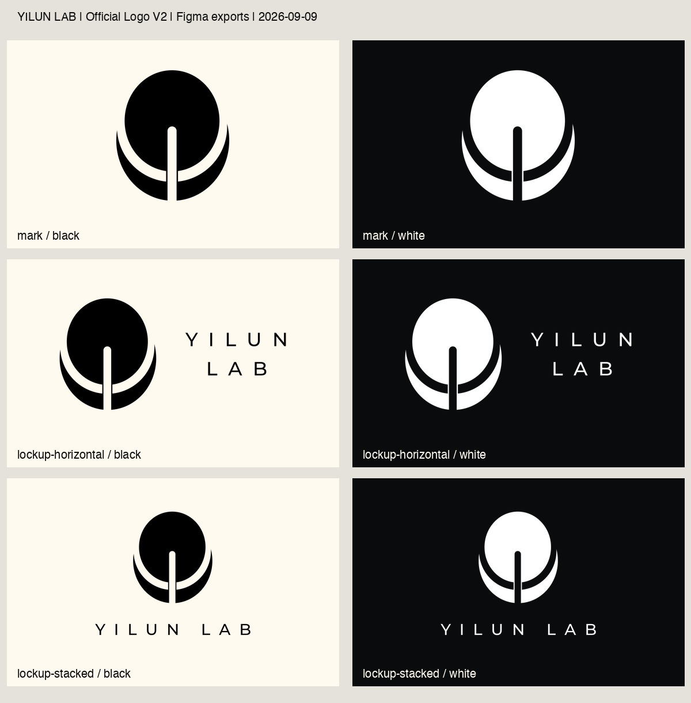

# YILUN LAB Logo — Production V2

设计母版：[Figma · Official Logo V2](https://www.figma.com/design/aCdzGGtkA3zFmZVYdFAQnV/Yilun-Lab-Logo?node-id=48-6)。

更新：2026-09-09。母版包含标志、横版组合、竖版组合的黑白六款；均为闭合矢量路径。旧版的两层亮度蒙版已移除，中央竖槽和弧形间隙是真实透明区域，字标已轮廓化。

## 母版与导出流程

**[Figma 正式入口](https://www.figma.com/design/aCdzGGtkA3zFmZVYdFAQnV/Yilun-Lab-Logo?node-id=48-6) → 导出 SVG/PDF → Illustrator 验证 → public assets → PNG/JPG。**

- 所有后续造型、字距、组合布局改动先在 Figma 完成。
- `svg/`、`pdf/` 是 Figma 本次实际导出的原文件，未另行重绘；校验值见 [manifest.json](manifest.json)。
- Figma 第一页为正式母版 `Official Logo V2`；后面保留 `Official Logo V1` 与 `Playground` 作为历史参考（2026-09-09 按用户最新要求恢复）。网站导出继续使用 V2。
- Figma 六个画板已配置 SVG 和 PDF 导出；画板无可见背景填充，关闭 Clip content。
- 先在 Illustrator 打开导出文件，检查竖槽、下弧、字标与透明区域；白色版本用透明网格检查。
- 替换本目录 SVG/PDF 后，在仓库根目录运行 `rtk proxy node scripts/render-logos.mjs` 与 `rtk proxy node scripts/check-logos.mjs`。前者只生成位图派生版本，不改变设计几何。重新导出后同步更新 manifest 日期和哈希。

## 文件选择

| 组合 | 黑色 SVG | 白色 SVG | 黑色 PDF | 白色 PDF |
|---|---|---|---|---|
| 标志 / Mark | [SVG](svg/yilun-lab-mark-black.svg) | [SVG](svg/yilun-lab-mark-white.svg) | [PDF](pdf/yilun-lab-mark-black.pdf) | [PDF](pdf/yilun-lab-mark-white.pdf) |
| 横版 / Horizontal | [SVG](svg/yilun-lab-lockup-horizontal-black.svg) | [SVG](svg/yilun-lab-lockup-horizontal-white.svg) | [PDF](pdf/yilun-lab-lockup-horizontal-black.pdf) | [PDF](pdf/yilun-lab-lockup-horizontal-white.pdf) |
| 竖版 / Stacked | [SVG](svg/yilun-lab-lockup-stacked-black.svg) | [SVG](svg/yilun-lab-lockup-stacked-white.svg) | [PDF](pdf/yilun-lab-lockup-stacked-black.pdf) | [PDF](pdf/yilun-lab-lockup-stacked-white.pdf) |

- **SVG**：网站、数字排版、可编辑矢量交换。
- **PDF**：交给排版与印前人员的矢量稿；六份均无嵌入位图、无字体绘制。保留 Figma 原生 RGB 颜色，未制作 CMYK/专色分色版或白墨专色版。按最终使用尺寸等比放置。
- **PNG**：透明位图，适合文档、幻灯片；标志 1024×1024，横版 2400×1200，竖版 2400×2400。
- **JPG**：固定背景预览；黑色在 cream `#FFFAF0` 上，白色在 near-black `#0A0B0D` 上。与 PNG 同尺寸，不作为印刷矢量源。

三种组合 × 黑白两色 × 四种格式 = **24 份文件**。原有文件名保留，新增竖版 PNG、标志及竖版 JPG 和六份 PDF。

## 对齐规则

按可见路径外接框居中，不用蒙版的外框或图形重心代替外接框。标志原有的轻微不对称保留。

| 组合 | 画板 | 本次修正 |
|---|---|---|
| 标志 | 256×256 | 内容向左 1 px、向上约 0.402 px，外接框居中 |
| 横版 | 512×256 | 文字相对标志上移约 11.898 px；整体再居中，保留原水平间距 |
| 竖版 | 365×365 | 标志与字标分别水平居中；整体下移约 8.372 px，保留垂直间距 |

这些是几何对齐，不代表已重新设计光学校正。新一轮视觉微调也应先修改 Figma。

## 已完成验证

- 六份 SVG 仅含 `svg` 和 `path`，无 mask、clipPath、stroke、image、text、filter。
- 三组黑白版路径相同，画布尺寸相同；透明 PNG 与当前 SVG 渲染一致。
- 六份 SVG 均实际在本机 Adobe Illustrator 2026 打开检查；白色版额外检查透明网格。
- 六份 Figma PDF 已用 Poppler 渲染并目视检查；竖版黑色 PDF 另在 Illustrator 打开检查。

